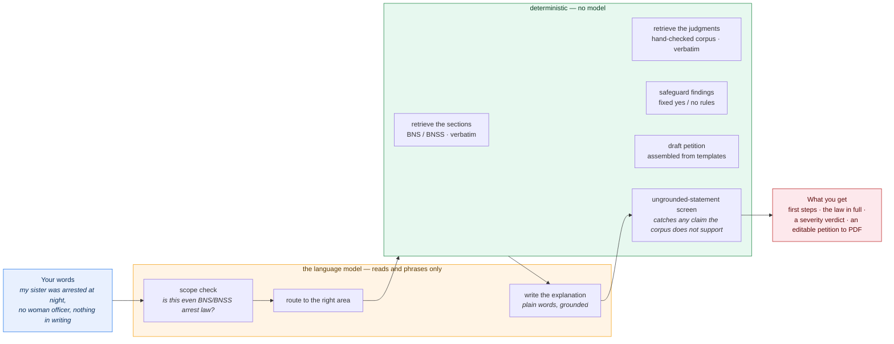
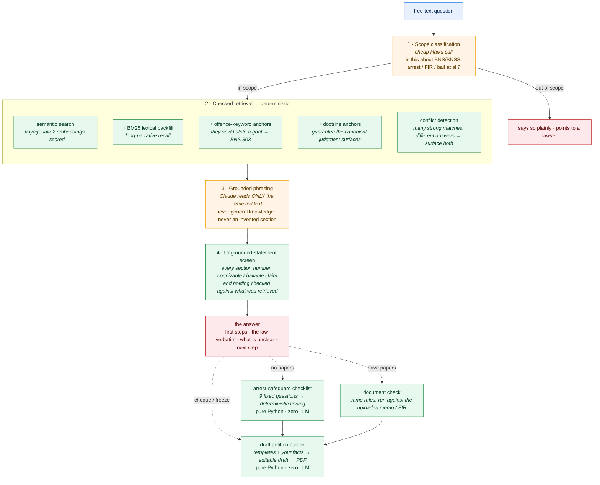

# Recourse

### The legal AI that isn't allowed to make up the law.

Plain-English help for a person facing an **arrest, an FIR, a night in custody**, a **bounced-cheque case** or a **frozen bank account** — and for the family standing outside the police station. Every section and every judgment behind an answer is **retrieved and quoted, never generated**. The safeguard findings and the draft court petition are produced by **fixed rules, with no model in the loop**.

**Live:** <https://recourse.co.in> &nbsp;·&nbsp; **Backup:** <https://recourse.up.railway.app> &nbsp;·&nbsp; **2-min walkthrough:** <https://tanbir-ahm.github.io/recourse-walkthrough/>

    

---

> ## The one idea
>
> A general-purpose chatbot asked *"is this arrest legal?"* will give a confident answer and cite a Supreme Court judgment **that does not exist**. In a bail matter, that mistake costs someone their liberty.
>
> Recourse is built so that **the language model is never in the legal-reasoning path.** It reads your situation, routes it, and phrases the reply in plain words. Everything with legal content — the section, the judgment (shown to you verbatim), the finding on each safeguard, the petition — comes from a hand-checked corpus and deterministic Python. A hallucinated citation isn't *reduced* here. It's **structurally impossible**.



**Read the colours.** Amber is the only place a language model runs — reading and phrasing. Green is deterministic Python. No legal judgment ever crosses from amber into green.

---

## Who it is for

**The person the case is happening to, and their family — at the moment it is happening.** Not law firms. Every other legal-AI tool in this space builds for the advocate; this one is built for the person in the lock-up's family, standing outside a police station at 11 pm — and, equally, for the **legal-aid lawyer or the junior on bail work** who needs the safeguards mapped and a first-draft petition in five minutes instead of forty-five.

## The problem

More than three-quarters of India's prison population are **undertrials** — people not convicted of anything. The decisions that matter are made in the first 24 hours, and the people in the room usually don't know that:

- an arrest must come with the **grounds of arrest**, in writing, in enough detail to answer and seek bail (*Prabir Purkayastha*, *Vihaan Kumar*);
- a woman ordinarily **cannot be arrested between sunset and sunrise** (s. 43(5) BNSS);
- for an offence punishable up to 7 years, the police are expected to serve a **notice to appear**, not arrest straight away (*Arnesh Kumar*, *Satender Kumar Antil*);
- once the **60- or 90-day chargesheet deadline** passes, bail stops being discretionary and becomes a **right** (s. 187 BNSS).

And since **1 July 2024**, the IPC, CrPC and Evidence Act were replaced wholesale by the BNS, BNSS and BSA — so even the section numbers people half-remember are now wrong.

These rights exist on paper and are lost in practice, because no lawyer is in the room.

---

## What you get

Ask in plain words. Recourse returns three things, in the order a frightened person needs them.

### 1 · An answer, traced to the source

A short **what to do right now**, then **what the law says**, then **what's still unclear** (the facts that would change the answer), then the next step. Under *"Read the source,"* every BNS/BNSS section and every judgment the answer used — shown **in full, word for word**. Nothing is paraphrased into existence; a case is never named in prose without its passage on screen.

### 2 · A deterministic verdict — no AI in it

**No papers?** Answer nine plain yes/no questions. Each maps by a **fixed rule** — the model is not involved at all — to a finding on every safeguard (written grounds, 24-hour production, night arrest of a woman, default bail, medical exam …), each with the section and the judgment behind it, and a severity band from *"No safeguard clearly broken"* to **"Critical — rights likely violated."**

**Have the papers?** Upload the arrest memo, FIR copy or remand order and the same engine checks each safeguard against what the document actually says.

### 3 · A draft petition you can take to court

Recourse assembles a **draft High Court petition** from the findings and your own account — cause title, grounds, prayer, affidavit, index — **editable on the page** and one click from a formatted **PDF** with a `RECOURSE — DRAFT PETITION` letterhead. Available for illegal arrest, Section 138 cheque cases and frozen accounts. Every unknown is left as `[ ___ ]`; every case passage carries a *"not independently verified"* flag until it is checked in the judgment. A starting point for a lawyer, not a filed document.

---

## Also on WhatsApp — the identical engine, no website required

The exact pipeline above — scope check, checked retrieval, grounded phrasing, the ungrounded-statement screen — runs unmodified behind a WhatsApp front door. Nothing about the safety architecture changes with the interface: the model still never decides the law, every reply still carries the section and the judgment behind it. Only how the question arrives changes.

Built and pressure-tested against real conversations, not just designed:

- **Follow-up, in context.** Ask about a frozen account, then ask *"so was 107 BNSS mandatory?"* — Recourse answers as a continuation of the same conversation, without being re-told the facts.
- **Duplicate-delivery protected.** A slow reply used to read as a failure and trigger a retry — the same question, answered three times, three real judgment lookups. Found on real traffic, fixed at the source: an instant acknowledgement, then a message-ID check that guarantees exactly one real answer per question, however many times delivery is retried underneath it.
- **No dead ends.** Cheque-bounce and bank-freeze questions are answered inline, same as the website — never a redirect to a screen that doesn't exist inside a chat.

**Proven end-to-end on real WhatsApp conversations, currently in sandbox pilot.** Opening a public number is the next step — see [Roadmap](#roadmap).

---

## What it covers today

| Area | What it answers |
|---|---|
| **Arrest, FIR & custody** | grounds of arrest, arrest memo (s. 36), notice-before-arrest (s. 35(3)), 24-hour production, night arrest of a woman (s. 43(5)), *D.K. Basu* safeguards, cognizability and the power to arrest at all |
| **Default (statutory) bail** | the exact calendar date bail becomes a matter of right under s. 187 BNSS — computing **both** the 60- and 90-day date where the tier is ambiguous, and naming the condition that decides |
| **Cheque bounce** | Section 138 NI Act — the s. 139 presumption, the notice windows, territorial jurisdiction, compounding |
| **Bank-account freeze** | s. 106/107 BNSS, whether any legal authority was cited at all, blanket-freeze vs the disputed sum, Magistrate intimation |
| **Cyber / IT Act** | s. 66C / 66D impersonation from the accused's side; whether a cited IT Act section is still valid law (s. 66A was struck down) |
| **Old law → new law** | **1,074** IPC→BNS and **1,099** CrPC→BNSS mapped provisions — paste an old section, get the current one, flagged where the provision was substantively changed |

**By the numbers:** **436 BNS sections** with punishment / cognizability / bailability · a hand-checked corpus of landmark judgments · **1,642** embedded corpus chunks (`voyage-law-2`) · **27** automated test suites, the core of which pass on a fresh clone.

---

## How it works, end to end



**Stage 1 — Scope.** A layman asks *anything* ("how do I sue my neighbour," "is this legal," small talk), and semantic search always returns *something*. A cheap classifier catches "this isn't even the right kind of question" before an embedding call is spent.

**Stage 2 — Retrieval.** Real embeddings with real scores, checked against a similarity threshold. Then three recall aids that don't trust the cosine score alone: a **BM25 lexical backfill** for long narrative queries; **offence-keyword anchors** that pin the exact offence when you name an accusation in plain words; and **doctrine anchors** that guarantee a whitelisted settled-doctrine question surfaces its own canonical judgment. **Conflict detection** surfaces "multiple strong matches with different answers" as its own case rather than silently picking one.

**Stage 3 — Phrasing.** Claude is given *only* the retrieved text and instructed never to go beyond it — it explains and phrases, it does not decide or invent.

**Stage 4 — The screen.** Because the instruction alone is not a hard guarantee (a real ~1-in-10 case slipped through in testing, where the model named a real BNSS section it was never given), every section number, every cognizable/bailable claim and every holding in the drafted answer is checked against what was actually retrieved **before anyone sees it**.

**The checklist, the document check and the petition builder contain no LLM at all.**

---

## The honesty machinery

- **Four states, not two.** Findings are *Compliant*, *Non-Compliant* (a confirmed defect), *May be Non-Compliant* (a defect inferred from a conspicuous silence — a memo that documents every other safeguard but is silent on the mandatory notice) and *Cannot Determine* (the rule applies but there isn't enough to check it). Police documents violate by omission far more than by admission.
- **"Still unclear."** Every answer names the facts it doesn't have that would change it.
- **Both bail dates.** Where an attempt/abetment section makes the default-bail tier ambiguous, Recourse computes both the 60- and the 90-day date and names the condition that decides — rather than withholding a deadline a family urgently needs.
- **The concordance is a pointer, not a verdict.** Old→new mappings are flagged where the provision was substantively changed; the tool says "verify the element you rely on," never "these are the same."
- **Struck-down law is flagged.** Ask about IT Act s. 66A and it tells you it was declared unconstitutional in *Shreya Singhal*, instead of reciting dead text.
- **Everything is shown.** "Read the source" carries the full section text and the judgment paragraphs — not a summary of them.

---

## Repository map

The live product is **`recourse_app.py`** (Streamlit, at recourse.co.in) over the engine in **`chat_assistant.py`**. The older four-mode document analyzer (`app.py`) still runs and is still tested, but the public site is the single-question flow.

### The engine
| File | Does |
|---|---|
| `chat_assistant.py` | the free-text engine — scope check, retrieval orchestration, grounded phrasing, the ungrounded-statement screen, offence anchors, the deterministic freeze/cheque nudges |
| `semantic_retrieval.py` | embeddings retrieval with scores + conflict detection; per-domain carve-outs; BM25 lexical backfill |
| `retrieval.py` | exact lookup — a section's real text by number, a judgment's paragraphs by number |
| `doctrine_anchors.py` | guarantees a settled-doctrine question surfaces its canonical judgment |
| `statute_doctrine_map.py` · `judgment_doctrine_map.py` | keyword → the exact statute / judgment paragraph that governs a situation |

### The deterministic verdict — no LLM
| File | Does |
|---|---|
| `arrest_safeguard_checklist.py` | 9 fixed yes/no safeguards → per-rule finding + severity band |
| `recourse_upload.py` → `main.py` | the same compliance checks, run against an uploaded arrest memo / FIR / remand order |
| `main.py` | the compliance engine — the `check_*` functions, default-bail date maths, the BNS reference-table wiring |
| `bns_section_data_v2.py` | 436 BNS sections — punishment ceiling, cognizable, bailable |
| `statute_concordance.py` | IPC↔BNS / CrPC↔BNSS lookup over a checked 1,132-pair table |
| `itact_section_status.py` | is this IT Act section still valid law? |

### The draft petition — no LLM
| File | Does |
|---|---|
| `petition_draft.py` | assembles the High Court petition — arrest (from the checklist or the document check), cheque (s. 138) and freeze; the ReportLab PDF renderer |
| `draft_layer.py` | the lighter Magistrate-representation / SP-complaint templates |

### WhatsApp front door (pilot)
| File | Does |
|---|---|
| `whatsapp_bot.py` | the FastAPI receptionist — receives a message, calls the same `chat_assistant.answer_question()`, unmodified; background-task dispatch + message-ID dedup so a slow network can never re-answer the same question |
| `whatsapp_formatter.py` | an answer, split into natural WhatsApp-sized messages, markdown bold converted to WhatsApp's own |
| `whatsapp_store.py` | the conversation memory the website doesn't have — one running history per phone number, so a follow-up isn't re-explained from scratch |

### Doctrine maps & data
`cheque_bounce_doctrine_map.py` · `freeze_doctrine_map.py` · `itact_section_data.py` · `bns_section_data.py` · `settled_doctrine_whitelist.py`

### Corpus & build scripts
`corpus/` (raw statute + judgment JSON) · `chunks/` (pre-chunked) · `embeddings/corpus_embeddings.json` (38 MB, `voyage-law-2`) · `build_*` / `chunk_*` / `embed_corpus.py` (regenerate the corpus) · `fetch_*` (source the statutes and judgments)

### Evaluation
`eval_chat_answers.py` · `eval_recourse_battery.py` · `eval_related_judgments.py` — harnesses with recorded baselines (`PHASE6_BASELINE.md`)

### Tests
27 `test_*.py` files — grounding, conflict gating, match capping, the doctrine maps, the concordance, the checklist, the petition builder, the compliance checks, domain handoff. Each runs standalone: `python test_grounding.py`.

---

## Run it locally

```bash
git clone https://github.com/Tanbir-Ahm/recourse.git
cd recourse

python -m venv venv
venv\Scripts\activate          # Windows
# source venv/bin/activate     # macOS / Linux

pip install -r requirements.txt

# .env in the project root:
#   ANTHROPIC_API_KEY=sk-ant-...
#   VOYAGE_API_KEY=pa-...        # only needed to RE-EMBED the corpus

streamlit run recourse_app.py   # the live single-question app
# streamlit run app.py          # the older 4-mode document analyzer
```

Python 3.13. The embedded corpus ships in the repo, so retrieval works offline — only the Anthropic key is needed to run the app. Sample documents (`Sample_Arrest_Memo_*.pdf`, `Sample_Bank_Freeze_Notice_*.pdf`, `Sample_Legal_Notice_Section138.pdf`) are included.

```bash
# run the test suites
for f in test_*.py; do python "$f" || echo "FAIL: $f"; done
```

---

## Honest limitations

- **The corpus is deep, not broad.** It is a curated set of landmark judgments, chosen for the situations that decide a case for a family with no lawyer. Ask outside that and Recourse tells you it's out of scope rather than guessing.
- **Case-law and section data are current as of mid-2026** and are not yet version-controlled against future amendments — a real limitation for any tool in this space.
- **The model still phrases the prose.** The legal *content* is retrieved and screened; the connective language is generated. The screen catches unsupported legal claims, not every infelicity.
- **Not legal advice.** It reads what you tell it and checks it against publicly known requirements, for information. It cannot see facts outside what you give it. Anyone in a real situation should consult a qualified advocate or the nearest **District Legal Services Authority**, which provides that help free under NALSA.

---

## Roadmap

- **A public WhatsApp number.** The pilot is proven end-to-end; what's left is Meta's business verification, not engineering.
- More offence and situation coverage, verified the same way — search & seizure (NDPS s. 50), FIR-registration disputes (*Lalita Kumari*), summons to vulnerable persons (s. 179 BNSS).
- **Regional-language output** — the citizens least served by existing tools are the ones least served by English-only findings.
- A warm handoff to a real lawyer or the nearest DLSA.
- Version-controlling the case-law and section data against amendments.

---

## How it was built

The engine — scope classification, checked retrieval over the BNS/BNSS and a verified judgment corpus, the offence-keyword anchors, the concordance, the ungrounded-statement screens, the "model never states a verdict" architecture — was built over several months with **Claude Code** (Anthropic's agentic CLI). The agent wrote most of the retrieval pipeline, the deterministic checkers, the petition builder and the 27 test suites; the architectural call — that the LLM stays out of the legal-reasoning path — was the human one.

The point isn't that an AI wrote a lot of the code. It's that an AI was used to build a legal tool whose defining design decision is **knowing exactly where an AI must not be trusted**.

The WhatsApp pilot is the proof this holds outside the website too: the identical engine, byte-for-byte, now answers behind a second front door — confirmation that the safety architecture lives in the engine, not in any one interface built on top of it.

Built with Python · Streamlit · the Anthropic API (extraction, scope, phrasing — never legal judgment) · Voyage AI embeddings (`voyage-law-2`) · ReportLab. Deployed on Railway.

---

## About

Built by **Tanbir Ahmed**, a former executive magistrate moving into legal technology — drawing on direct experience of criminal procedure and the administration of arrests, remands and detention to encode the safeguards that most often go unenforced in practice. The principle throughout: serve the person against institutional power, and never claim more certainty than the evidence supports.

---

## Disclaimer

**This is not legal advice.** Recourse reads what you tell it and checks it against publicly known procedural requirements for educational and informational purposes. Its findings — especially those marked *"May be Non-Compliant,"* which are inferences from what a document omits — are not legal conclusions. The section mappings and case-law references reflect careful research and should be independently verified before being relied upon. Anyone facing a real legal situation should consult a qualified advocate.

## Licence

MIT — see [`LICENSE`](LICENSE).
